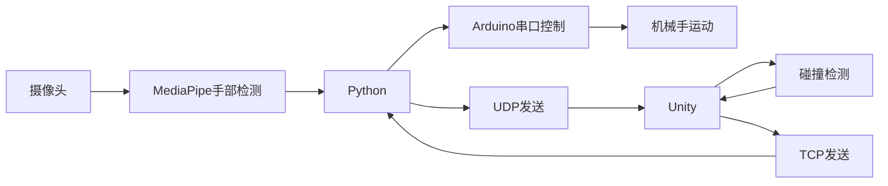

# 手势控制的机械手仿生系统

## 项目成员

### 项目概述
本项目实现了一套比较完整的**虚拟现实手势控制机械臂系统**，通过Mediapipe在Python中实现摄像头实时捕捉手部关节点，利用UDP协议传输至Unity引擎，且该平台中重建虚拟手模型，并通过cs脚本检测碰撞，达到识别手指与虚拟物体的交互。当检测到碰撞时，系统会通过TCP网络协议发送控制指令到Python服务器，最终驱动Arduino控制实体机械手同步运动。

### Intro
物理法则的存在赋予了人类的创造力：重力催生了各种球类运动，电磁的定律给予了电脑运行的可能性，光子的独特运动轨迹产生了视觉艺术。有了限制，才会产生更多的可能性。OneTouchReality 将虚拟世界的力学作用于现实世界，让使用者在视觉与听觉之外还能感受到新的一个维度：触觉。它给予了触摸虚拟物体，一个电子幽灵的可能性，让使用者能在电磁的约束下和虚拟世界互动。


### 概念演变
- 最早的想法思路源自于外骨骼，既然外骨骼能带动人的手达到省力，加强力量的用途，那或许也能限制人的运动，模拟触觉和受力。最早的概念被称为“反向外骨骼“。最初的构想由一套刚体手套（类似于盔甲）来驱动，每个指关节均需要一个舵机，但是在跑进硬件实验室后发现舵机根本不够用，总共就9颗舵机实在捉襟见肘。于是选择模仿线控机器手。在参考，分析人体的手部运动方式后我们发现人指头的运动可以分为两种： 屈张和转动。在这些运动方式下，指尖端点到手背某一个点的距离是一直在变化的，虽然一些指尖位置到手背的距离是相同的但是相隔较远不会有太大的干扰。
- 该装置的目的是模拟手部在触摸物体时收到的反向作用力，因为人一般不用手背触摸物体，在触摸物体中，手部的运动也大多为弯屈和向下转动手指，因此舵机只需要在指尖达到物体的判定表面时提供反向的拉力来限制手部运动，实现触摸到虚拟物体的感觉。
- 舵机总共5个采用交错式布局固定在手背，绞盘前方配备有束线器来保证正常的收放线。在每个手指段上都有束线器来引导线材的方向防止缠绕，滑落。指尖处线在一个与弹簧连接的杠杆连接，在线被收紧后，挪动手部就会感受到指尖被挤压的感觉，简单模拟触觉。最早本打算使用气动阀门连接气囊，通过气囊膨胀来模拟指尖触觉但是实验室没有气泵也没阀门或者气囊，于是使用了简单的机械结构作为替代。
- 相较于早期的刚体手套方案，更加灵活轻便，也可以适配更多尺码。


### 技术栈
1. **计算机视觉**：使用 MediaPipe 提取手部关键点数据，实现高精度的手势识别。
2. **Unity引擎**：在 Unity 中接收手势数据，并将其映射到虚拟机械臂的关节，实现三维空间控制。
3. **网络通信**：
   - UDP：通过 UDP 协议将手势数据从 Python 传输到 Unity，确保数据传输的低延迟。
   - TCP：Unity向Python服务器发送控制指令
4. **硬件控制**：Arduino舵机控制
5. **跨平台通信**：
   - Python TCP服务器
   - 串口通信(PySerial)

### 系统架构


### 核心功能实现

1. **手部运动捕捉**：
   - Python使用MediaPipe库处理二维摄像头数据，cv2库实现摄像头调用和识别。头文件包含了必要的库导入和初始化设置。
   ```python
   import cv2
   import mediapipe as mp
   import socket
   import json
   import time
    ```
   - 21个手部关键点通过UDP实时发送到Unity，且严格按照Mediapipe的顺序发送。
   - 发送格式利用UTF-8编码，确保数据传输的稳定性。
   ```python
        data_str = json.dumps(data)
        sock.sendto(data_str.encode('utf-8'), (UDP_IP, UDP_PORT))
    ```
   - 关键点坐标转换（镜像处理/坐标系转换）：Python和unity的坐标系不同，需要进行转换处理。具体体现在y轴需要镜像处理，z轴需要取反。同时由于摄像头捕捉二维平面，需要自行计算纵深坐标，所以在处理不同轴时需要额外考虑放大倍数。
   ```python
   #rec.py
   def cc(landmarks):
       lmks = []
       for _ in landmarks:
           x = _.x * 0.3
           y = _.y * 0.3
           z = _.z * 0.7

           lmks.append({
               "x": x,
               "y": 1 - y,
               "z": -z,
               "id": len(lmks)
           })
       return lmks
   ```

2. **Unity手部重建**：
   
    *由于团队内缺少利用Unity开发大型项目的经验，部分debug由AI完成。*

   - Unity中使用C#脚本接收Python发送的手部关键点数据，并重建手部模型。通过`UDPReceiver.cs`脚本实现数据接收和解析。
   ```csharp
       private void ReceiveData()
    {
        IPEndPoint anyIP = new IPEndPoint(IPAddress.Any, port);
        while (isRunning)
        {
            try
            {
                byte[] data = udpClient.Receive(ref anyIP);
                receivedData = Encoding.UTF8.GetString(data);
                newDataAvailable = true;
            }
            catch (Exception e)
            {
                Debug.LogError(e.ToString());
            }
        }
    }
    ```
    此段代码实现了UDP数据接收，并将接收到的JSON格式数据解析为手部关键点坐标。在Unity中，空物体NetWorkManager作为网络管理器，负责处理数据接收和发送。端口为5065，IP地址为127.0.0.1(本机)。
   - 动态生成手指骨骼圆柱碰撞体:使用21个关键点数据创建手指骨骼的圆柱碰撞体，实时跟随手指运动。在头文件中，定义了手指骨骼的碰撞体生成逻辑。
    ```csharp
   // FingerBoneCollider.cs
    public UDPReceiver udpReceiver;
    public bool mirrorHand = true;

    // root
    public Transform handRoot;
    
    // joints
    public Transform wrist;
    public Finger thumb;
    public Finger index;
    public Finger middle;
    public Finger ring;
    public Finger pinky;

    public float positionSmooth = 15f;
    public float globalScale = 1.0f;

    ```
    - 手部模型的骨骼层级结构：手部模型由多个子物体组成，每个手指对应一个`Finger`类，包含关节位置和碰撞体。每一根手指的骨骼4个关节组成，分别为：mcp, pip, dip, end。每个关节对应一个Transform对象。手部模型的根节点为`handRoot`，各个手指通过Transform组件连接到根节点上。
    ```csharp
    // HandController.cs
    void Update()
    {
        if (udpReceiver == null || udpReceiver.currentHandData == null ||
            udpReceiver.currentHandData.landmarks == null ||
            udpReceiver.currentHandData.landmarks.Count < 21)
            return;

        UpdateHandRootPosition();
        UpdateJointPositions();
        CalculateWristToThumbDistance();
        UpdateDistanceDisplay();
        //globalScale = (scale / wristToThumbDistance)*0.1f;
    }
    ```
    - 由于MediaPipe对于纵深的限制，手部模型的纵深坐标利用了手腕到拇指的距离来计算。通过`Distance`方法计算手腕到拇指的距离，并根据该距离调整手部模型的位置和缩放比例。
    ```csharp
    //HandDistanceController.cs
    void LateUpdate()
    {
        if (!wristJ || !thumbBaseJ) return;
        float currentJD = Vector3.Distance(wristJ.position, thumbBaseJ.position);

        if (currentJD < 0.0001f) return;
        Z = -(0.00225f / currentJD - 0.1f);
        ApplyPosition();
    }
    ```
    该问题困扰了很长时间，起初发现可以识别手在二维中的上下左右移动，但是当手靠近屏幕时，unity中仅呈现数值变化而没有实际位移。第一第二日的开发中，该思路已经被放弃，改为直接使用MediaPipe的z轴数据来控制手部位置。后来发现MediaPipe的z轴数据并不准确，导致手部模型在纵深方向上漂移。然后通过计算手腕到拇指的距离来动态调整手部位置和缩放比例，发现问题依然没有解决。最后软件负责人考虑了脚本的执行顺序问题，发现是因为手部位置被先刷新再移动了，导致手部位置无法正确更新。通过在Project Settings中调整脚本执行顺序和位置更新逻辑，最终实现了手部模型的正确位置和缩放。

   - 骨骼生成（以食指为例）：头文件中包含一根骨头需要的两端指关节。每个骨头的碰撞体由`IndexGenerator`脚本生成，碰撞体的半径和长度根据关节位置计算。
   ```csharp
    // IndexGenerator.cs
    [Header("Joint Settings")]
    public Transform startJoint;
    public Transform endJoint;

    [Header("Bone Settings")]
    public float radius = 0.001f;
    public FingerCollisionManager.FingerType fingerType;
    public int boneIndex;
    ```

3. **碰撞检测系统**：
    - 使用`class: FingerCollisionDetector`实现手指与虚拟物体的碰撞检测。每个手指的碰撞状态存储在字典中，使用`OnTriggerEnter`和`OnTriggerExit`方法更新碰撞状态。
   ```csharp
   // CollisionAndColorChanger.cs

    private void OnTriggerEnter(Collider other)
    {
        if (other.CompareTag(targetTag))
        {
            isColliding = true;
            if (renderer != null)
            {renderer.material.color = collisionColor;}
            FingerCollisionManager.Instance?.UpdateBoneCollision(fingerType, boneIndex, true);
        }
    }

    private void OnTriggerExit(Collider other)
    {
        if (other.CompareTag(targetTag))
        {
            isColliding = false;
            if (renderer != null){renderer.material.color = originalColor;}
            FingerCollisionManager.Instance?.UpdateBoneCollision(fingerType, boneIndex, false);
        }
    }
   ```

   以及，在`CreateBone`方法中，创建碰撞体并添加到手指骨骼上。且当手指与虚拟物体发生碰撞时，碰撞体会变为`collisionColor`颜色以示意。`collisionColor`在头文件中定义。在本项目里，所有手指原颜色均为白色，碰撞后大拇指变为红色，食指变为黄色，中指变为蓝色，无名指变为绿色，小指变为紫色。
   ```csharp
        detector = bone.AddComponent<FingerCollisionDetector>();
        detector.fingerType = fingerType;
        detector.collisionColor = collisionColor;
        detector.targetTag = targetTag;
        detector.boneIndex = boneIndex;

        Renderer renderer = bone.GetComponent<Renderer>();
        renderer.material = new Material(Shader.Find("Standard"));
        renderer.material.color = Color.white;
    ```
    - 碰撞检测逻辑：当手指与虚拟物体发生碰撞时，`FingerCollisionDetector`会调用`OnTriggerEnter`方法，记录碰撞状态并触发弯曲度计算。

4. **舵机手指计算**：
   - 一根手指分为四根骨肉，其中mcp作为手掌中的骨头被忽略，pip、dip、end三个骨头作为手指的弯曲度计算依据。每根骨头都有boneIndex，其中pip编号为0，dip编号为1，end编号为2。通过`FingerCollisionManager`类来管理手指碰撞状态和计算弯曲角度。
   ```csharp
   // FingerCollisionManager.cs
    private void CalculateAndSendAngle(FingerType finger)
    {
        int collisionCount = 0;
        foreach (bool collided in fingerCollisions[finger])
        {if (collided) collisionCount++;}
        
        int angle = 0;
        if (collisionCount == 1) angle = 90;
        else if (collisionCount == 2) angle = 135;
        else if (collisionCount >= 3) angle = 180;
        int fingerIndex = (int)finger;
        if (NetworkManager.Instance != null){NetworkManager.Instance.SendCommand(fingerIndex, angle);}
        else{Debug.LogWarning("NetworkManager not available to send command");}
    }
   ```
   利用计量碰撞骨骼的数量来计算手指的弯曲角度，当有一个骨头发生碰撞时，舵机角度为90度；当有两个骨头发生碰撞时，舵机角度为135度；当有三个骨头发生碰撞时，舵机角度为180度。
   - 该场景可以拓展。Unity中，当骨骼碰到标签为`Player`的物体时，触发碰撞检测。因此，凡是含有的物体都可以被识别为虚拟物体。可以通过添加不同标签的物体来实现不同的交互效果。
   ```csharp
   //CollisionAndColorChanger.cs
   public class FingerCollisionDetector : MonoBehaviour
   {
       public FingerCollisionManager.FingerType fingerType;
       public int boneIndex;
       public Color collisionColor = Color.blue;
       public string targetTag = "Player";
       
       private new Renderer renderer;
       private Color originalColor;
       private bool isColliding = false;
    ...
   ```

5. **硬件控制链**：
   - Unity → Python TCP服务器 → Arduino串口 → 舵机
   - 指令格式：`fingerIndex,angle` (e.g. `2,135`)，其中`fingerIndex`为手指索引，`angle`为弯曲角度。
   - 舵机控制：Arduino接收指令后，控制对应舵机转动到指定角度。舵机总共5个采用交错式布局固定在手背，绞盘前方配备有束线器来保证正常的收放线。在每个手指段上都有束线器来引导线材的方向防止缠绕，滑落。指尖处线在一个与弹簧连接的杠杆连接，在线被收紧后，挪动手部就会感受到指尖被挤压的感觉，简单模拟触觉。最早本打算使用气动阀门连接气囊，通过气囊膨胀来模拟指尖触觉但是实验室没有气泵也没阀门或者气囊，于是使用了简单的机械结构作为替代。相较于早期的刚体手套方案，更加灵活轻便，也可以适配更多尺码
   - 原计划直接Unity使用Ardunity连接Arduino，但在查询资料时发现Ardunity的更新停滞，且不支持最新的Unity版本。于是改为使用Python作为中间层，通过TCP协议与Unity通信，接收手指弯曲角度指令，并通过串口发送到Arduino。
   - Python TCP服务器代码（端口`8000`）：
   ```python
   def send_to_arduino(ser,data):
    if not ser.is_open:
        try:
            ser.open()
        except SerialException:
            print("cannot onpen serial")
            return False
    try:
        command = f"{data}\n"  
        ser.write(command.encode('utf-8'))
        print(f"Sent: {data}")
    except SerialException as e:
        print(f"write error: {e}")
        print(f"fail sent: {e}")
    ```
    - Arduino串口控制代码，利用`Servo.h`库（端口`COM6`）：
    ```cpp
    void loop() {
    if (Serial.available() > 0) {
    String data = Serial.readStringUntil('\n');
    data.trim();
      
    int spaceIndex = data.indexOf(' ');
    if (spaceIndex != -1) {
        int finger = data.substring(0, spaceIndex).toInt();
        int angle = data.substring(spaceIndex + 1).toInt();
        
        if (finger >= 0 && finger < 5 && angle >= 0 && angle <= 180) {
        servos[finger].write(angle);
        Serial.print("Moving servo ");
        Serial.print(finger);
        Serial.print(" to ");
        Serial.println(angle);
    }}}}
    ```


### 项目文件结构
```plaintext
项目/
├── 项目报告.md
├── rec.py
├── servo_five.py
├── Assets/
│   ├── Scripts/
│   │   ├── CollisionAndColorChanger.cs
│   │   ├── FingerCollisionManager.cs
│   │   ├── NetworkManager.cs
│   │   └── HandController.cs
│   │   └── HandDistanceController.cs
│   │   └── IndexGenerator.cs
│   │   └── RingGenerator.cs
│   │   └── MiddleGenerator.cs
│   │   └── ThumbGenerator.cs
│   │   └── PinkyGenerator.cs
│   │   └── UDPReceiver.cs
│   └── Scenes/
│       └── SampleScene.unity
└── five_move/
    └── servo_five.ino
```

### 用户指南
1. **安装依赖**：
   - Python：安装`mediapipe`, `opencv-python`, `socket`, `json`等库。
   - Unity：导入项目文件夹中的Assets目录。
   - Arduino：安装`Servo.h`库。
2. **运行步骤**：
   - 启动Python脚本`rec.py`，开始捕捉手部关键点并发送数据。
   - 启动Arduino IDE，上传`five_move.ino`代码到Arduino板。待舵机初始化完成后，关闭IDE。
   - 启动Python脚本`servo_five.py`，开始监听Unity发送的手指弯曲角度指令。
   - 在Unity中打开`SampleScene.unity`场景，运行Unity项目。
   - 点击Unity中的“Play”按钮，开始使用。 


### 优化目标
- 舵机只有180度十分致命根本无法发挥出绞盘多圈旋转的优势，活生生把绞盘降级成了摇臂。
- 穿戴稍微有点麻烦。（但是等有了正经魔术贴一切都会好起来的orz）
- 急停按钮避免舵机故障颤抖或者视觉捕捉错误时导致舵机转动过大拉断手指，不过由于舵机只有180度转动所以暂时取消了。
- 舵机导致手指过度拉伸屈张，需要急停设备或者是扭力张力检测，保证安全
- 需要提升人体工学和舒适度，避免设备压迫血管导致血液循环不畅，特别是指尖血压较低的位置。
- 硬件产品化与友好化：通过改善结构设计，让机械臂更加符合人体工学，同时规范化，便于后续拓展优化。
- 增加交互体验：结合力传感器、触觉传感器等，实现更丰富的交互。
- 优化手部识别系统：进一步优化手部检测算法，提高精度和响应速度。


### 商业评估：
走低端路线下沉市场or 高端市场小体量高利润，高度客制化。
目前而言有一定风险因为本身技术门槛不够高：从电子设备再到算法，制造缺乏足够的准入门槛来避开竞争。但是可以以量取胜，率先制造生产达成先发优势，积累原始用户。初始的版本或许可以强调用户粘性：依靠一些特点诸如舒适度，独特平台，操控方式，高兼容性和生态来完成用户的积累，提高转换系统，品牌的机会成本，便于在后期竞争中对其他可能的品牌取得优势。
在初期竞争中高价，高利润高配置是可能的因为市场很明显不可能饱和，有大量的非弹性的刚需可以满足，从科技发烧友到创客，虚拟主播或者是景区设施，这是一个全新的，没有明确直接竞争产业的项目。但在之后的竞争如果无法维持技术优势,可以下沉市场，利用机械结构简单低成本易维护来满足一些娱乐的需求。


### 应用场景
- 该手套可应用于AR/VR领域，提供虚拟现实的新的一个维度：力和触觉。通过连接力反馈手套，使用者可以感受到触摸物体时的反作用力。手套可以用于游戏，训练，提供交互的新一个维度，或者是给3维设计师使用，提供设计的快速及时感知，评估。在其他领域，或许也可以助力于机器人操控，医疗康复等。最直接的应用便是和vr联动成为虚拟现实设备的一部分，可以优先应用于小游戏或者是训练模拟诸如射箭，气动枪械射击，训练运动员的手部运动，建立肌肉记忆。
- 整个系统具有机械简单直接，柔性，小型化，低成本的特性，只需要简单的运算，视觉捕捉系统诸如单个摄像头，少量舵机即可运行。可以应用于对精度要求较低的领域诸如游戏，给游戏玩家更加身临其境的感知。
- 由于demo过于仓促，第二代迭代可以大幅提升新能：360度舵机，集成到手套的线更加便于穿戴，取消绞盘改用大长度摇臂，横置舵机，气动阀门驱动指肚的各个气囊模拟触觉，拓展力反馈区域：从手到手臂再到全身，实现头号玩家式的游戏体验和交互深度·。在全部完成后便可以应用于上本身/全身的运动，届时，便可以有更多的商业可能性： vr体验项目/5d电影体验大型游戏，或者是运动训练诸如拳击，滑雪，翼装飞行，游泳，体操等，抑或是情景模拟，大大的模糊虚拟与现实的边界。但是目前而言，虽然手部或者上半身的装置可以做到相当的轻量化，低成本从而应用于更多场景，甚至家用化。半身装置或许可以与vr设备配套，作为附属品一起售卖抑。但是全身的反馈需要相当的设施支持，这就使得全身版本在应用场景被局限，价格成本提高，与游乐场的项目竞争或者是用于专业训练，往高端市场发展，专注高精度高沉浸式体验。
- 在暑假我们会进一步升级，细化这个设计：更加产品化，可靠，便捷，更多的力反馈部位：从手再到手臂再到这个上半身。暑假虽然时间不多大家也不一定有时间相聚但是我们会线上协作一起升级我们的产品。


> 项目完整代码库：[here](https://github.com/CarterWells111/OneTouchReality)


