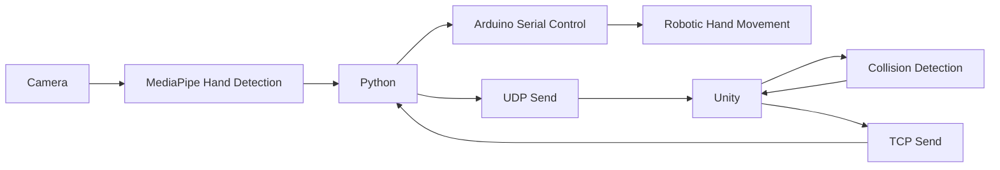

# Virtual Reality Gesture-Controlled Robotic Arm System

## Project Members

### Project Overview
This project implements a complete **virtual reality gesture-controlled robotic arm system**. It uses Mediapipe in Python to capture hand key points in real-time via a camera, transmits the data to the Unity engine using the UDP protocol, reconstructs a virtual hand model within the platform, and detects collisions using C# scripts to recognize finger interactions with virtual objects. When a collision is detected, the system sends control commands via the TCP network protocol to a Python server, which ultimately drives the Arduino to control the physical robotic hand for synchronized movement.

### Intro
The existence of physical laws empowers human creativity: gravity gave rise to various ball sports, the laws of electromagnetism enabled the operation of computers, and the unique motion of photons created visual arts. Limitations breed more possibilities. OneTouchReality applies the mechanics of the virtual world to the real world, allowing users to experience a new dimension beyond sight and sound: touch. It enables the possibility of touching virtual objects, electronic phantoms, allowing users to interact with the virtual world within the constraints of electromagnetism.

### Concept Evolution
- The initial idea originated from exoskeletons. If exoskeletons can assist human hands for effort-saving and strength enhancement, perhaps they could also restrict human movement to simulate touch and force feedback. The earliest concept was called the "Reverse Exoskeleton." The initial design involved a rigid glove (similar to armor) for actuation, requiring one servo motor per finger joint. However, upon visiting the hardware lab, it was discovered that there were far too few servo motors available—only 9 in total, which was insufficient. Thus, the choice was made to mimic a cable-driven robotic hand. After referencing and analyzing human hand movement patterns, we found that finger movements can be categorized into two types: flexion/extension and rotation. During these movements, the distance from the fingertip to a point on the back of the hand constantly changes. Although some fingertip positions might have the same distance to the back of the hand, they are far apart and unlikely to cause significant interference.
- The purpose of this device is to simulate the reaction force felt by the hand when touching an object. Since people generally don't use the back of their hand to touch objects, and hand movements during touch are mostly finger flexion and downward rotation, the servo motors only need to provide a pulling force to restrict hand movement when the fingertip reaches the detection surface of the object, creating the sensation of touching a virtual object.
- A total of 5 servo motors are used, arranged in a staggered layout fixed on the back of the hand. The winches are equipped with cable guides at the front to ensure proper cable retraction and release. Each finger segment has cable guides to direct the cables and prevent tangling or slipping. At the fingertip, the cable connects to a lever attached to a spring. When the cable is tightened, moving the hand creates a sensation of fingertip pressure, simply simulating touch. Initially, the plan was to use pneumatic valves connected to airbags, inflating them to simulate fingertip touch. However, the lab lacked air pumps, valves, or airbags, so a simple mechanical structure was used as an alternative.
- Compared to the early rigid glove design, this approach is more flexible, lightweight, and can adapt to a wider range of hand sizes.

### Technology Stack
1. **Computer Vision**: Uses MediaPipe to extract hand keypoint data, achieving high-precision gesture recognition.
2. **Unity Engine**: Receives gesture data in Unity and maps it to the joints of the virtual robotic arm for 3D space control.
3. **Network Communication**:
   - UDP: Transmits gesture data from Python to Unity via the UDP protocol, ensuring low-latency data transfer.
   - TCP: Sends control commands from Unity to the Python server.
4. **Hardware Control**: Arduino servo control.
5. **Cross-Platform Communication**:
   - Python TCP Server
   - Serial Communication (PySerial)

### System Architecture


### Core Functionality Implementation

1. **Hand Motion Capture**:
   - Python uses the MediaPipe library to process 2D camera data, and the cv2 library for camera invocation and recognition. The header file includes necessary library imports and initialization settings.
   ```python
   import cv2
   import mediapipe as mp
   import socket
   import json
   import time
    ```
   - 21 hand keypoints are sent to Unity in real-time via UDP, strictly following the Mediapipe order.
   - The sending format uses UTF-8 encoding to ensure data transmission stability.
   ```python
        data_str = json.dumps(data)
        sock.sendto(data_str.encode('utf-8'), (UDP_IP, UDP_PORT))
    ```
   - Keypoint coordinate transformation (mirroring/coordinate system conversion): The coordinate systems of Python and Unity differ, requiring conversion. Specifically, the y-axis needs mirroring, and the z-axis needs inversion. Also, since the camera captures a 2D plane, the depth coordinate needs to be calculated manually, so additional scaling factors need consideration when processing different axes.
   ```python
   #rec.py
   def cc(landmarks):
       lmks = []
       for _ in landmarks:
           x = _.x * 0.3
           y = _.y * 0.3
           z = _.z * 0.7

           lmks.append({
               "x": x,
               "y": 1 - y,
               "z": -z,
               "id": len(lmks)
           })
       return lmks
   ```

2. **Unity Hand Reconstruction**:
   
    *Due to the team's lack of experience in developing large projects with Unity, some debugging was assisted by AI.*

   - In Unity, a C# script receives the hand keypoint data sent from Python and reconstructs the hand model. The `UDPReceiver.cs` script handles data reception and parsing.
   ```csharp
       private void ReceiveData()
    {
        IPEndPoint anyIP = new IPEndPoint(IPAddress.Any, port);
        while (isRunning)
        {
            try
            {
                byte[] data = udpClient.Receive(ref anyIP);
                receivedData = Encoding.UTF8.GetString(data);
                newDataAvailable = true;
            }
            catch (Exception e)
            {
                Debug.LogError(e.ToString());
            }
        }
    }
    ```
    This code implements UDP data reception and parses the received JSON-formatted data into hand keypoint coordinates. In Unity, an empty GameObject named NetWorkManager acts as the network manager, handling data reception and transmission. The port is 5065, and the IP address is 127.0.0.1 (localhost).
   - Dynamic generation of cylindrical colliders for finger bones: Uses the 21 keypoint data to create cylindrical colliders for the finger bones, which follow finger movements in real-time. The header file defines the logic for generating colliders for the finger bones.
    ```csharp
   // FingerBoneCollider.cs
    public UDPReceiver udpReceiver;
    public bool mirrorHand = true;

    // root
    public Transform handRoot;
    
    // joints
    public Transform wrist;
    public Finger thumb;
    public Finger index;
    public Finger middle;
    public Finger ring;
    public Finger pinky;

    public float positionSmooth = 15f;
    public float globalScale = 1.0f;

    ```
    - Skeletal hierarchy of the hand model: The hand model consists of multiple child objects. Each finger corresponds to a `Finger` class, containing joint positions and colliders. Each finger bone consists of 4 joints: mcp, pip, dip, end. Each joint corresponds to a Transform object. The root node of the hand model is `handRoot`, and each finger is connected to the root node via Transform components.
    ```csharp
    // HandController.cs
    void Update()
    {
        if (udpReceiver == null || udpReceiver.currentHandData == null ||
            udpReceiver.currentHandData.landmarks == null ||
            udpReceiver.currentHandData.landmarks.Count < 21)
            return;

        UpdateHandRootPosition();
        UpdateJointPositions();
        CalculateWristToThumbDistance();
        UpdateDistanceDisplay();
        //globalScale = (scale / wristToThumbDistance)*0.1f;
    }
    ```
    - Due to limitations in MediaPipe's depth perception, the depth coordinate of the hand model utilizes the distance from the wrist to the thumb for calculation. The `Distance` method calculates the distance from the wrist to the thumb and adjusts the hand model's position and scale based on this distance.
    ```csharp
    //HandDistanceController.cs
    void LateUpdate()
    {
        if (!wristJ || !thumbBaseJ) return;
        float currentJD = Vector3.Distance(wristJ.position, thumbBaseJ.position);

        if (currentJD < 0.0001f) return;
        Z = -(0.00225f / currentJD - 0.1f);
        ApplyPosition();
    }
    ```
    This issue was problematic for a long time. Initially, it was found that up, down, left, and right movements of the hand in 2D could be recognized, but when the hand moved closer to the screen, Unity only showed numerical changes without actual displacement. During the first two days of development, this approach was abandoned in favor of directly using MediaPipe's z-axis data to control the hand position. Later, it was discovered that MediaPipe's z-axis data was inaccurate, causing the hand model to drift in the depth direction. Then, by calculating the distance from the wrist to the thumb to dynamically adjust the hand position and scale, the problem persisted. Finally, the software lead considered the script execution order and found that the hand position was being updated before being moved, preventing correct position updates. By adjusting the script execution order in Project Settings and the position update logic, the correct hand model position and scale were finally achieved.

   - Bone generation (using the index finger as an example): The header file includes the two end joints required for one bone. The collider for each bone is generated by the `IndexGenerator` script, with the collider's radius and length calculated based on the joint positions.
   ```csharp
    // IndexGenerator.cs
    [Header("Joint Settings")]
    public Transform startJoint;
    public Transform endJoint;

    [Header("Bone Settings")]
    public float radius = 0.001f;
    public FingerCollisionManager.FingerType fingerType;
    public int boneIndex;
    ```

3. **Collision Detection System**:
    - Uses `class: FingerCollisionDetector` to implement collision detection between fingers and virtual objects. The collision state of each finger is stored in a dictionary, updated using the `OnTriggerEnter` and `OnTriggerExit` methods.
   ```csharp
   // CollisionAndColorChanger.cs

    private void OnTriggerEnter(Collider other)
    {
        if (other.CompareTag(targetTag))
        {
            isColliding = true;
            if (renderer != null)
            {renderer.material.color = collisionColor;}
            FingerCollisionManager.Instance?.UpdateBoneCollision(fingerType, boneIndex, true);
        }
    }

    private void OnTriggerExit(Collider other)
    {
        if (other.CompareTag(targetTag))
        {
            isColliding = false;
            if (renderer != null){renderer.material.color = originalColor;}
            FingerCollisionManager.Instance?.UpdateBoneCollision(fingerType, boneIndex, false);
        }
    }
   ```

    Also, in the `CreateBone` method, colliders are created and added to the finger bones. When a finger collides with a virtual object, the collider changes to the `collisionColor` for visual indication. `collisionColor` is defined in the header file. In this project, all fingers are initially white. Upon collision, the thumb turns red, the index finger yellow, the middle finger blue, the ring finger green, and the pinky finger purple.
   ```csharp
        detector = bone.AddComponent<FingerCollisionDetector>();
        detector.fingerType = fingerType;
        detector.collisionColor = collisionColor;
        detector.targetTag = targetTag;
        detector.boneIndex = boneIndex;

        Renderer renderer = bone.GetComponent<Renderer>();
        renderer.material = new Material(Shader.Find("Standard"));
        renderer.material.color = Color.white;
    ```
    - Collision detection logic: When a finger collides with a virtual object, `FingerCollisionDetector` calls the `OnTriggerEnter` method, records the collision state, and triggers the bend angle calculation.

4. **Servo Finger Calculation**:
   - One finger is divided into four bones, where the mcp is ignored as it's within the palm. The pip, dip, and end bones are used as the basis for calculating the finger's bend angle. Each bone has a `boneIndex`, where pip is numbered 0, dip is 1, and end is 2. The `FingerCollisionManager` class manages the finger collision state and calculates the bend angle.
   ```csharp
   // FingerCollisionManager.cs
    private void CalculateAndSendAngle(FingerType finger)
    {
        int collisionCount = 0;
        foreach (bool collided in fingerCollisions[finger])
        {if (collided) collisionCount++;}
        
        int angle = 0;
        if (collisionCount == 1) angle = 90;
        else if (collisionCount == 2) angle = 135;
        else if (collisionCount >= 3) angle = 180;
        int fingerIndex = (int)finger;
        if (NetworkManager.Instance != null){NetworkManager.Instance.SendCommand(fingerIndex, angle);}
        else{Debug.LogWarning("NetworkManager not available to send command");}
    }
   ```
   The number of colliding bones is used to calculate the finger's bend angle. When one bone is colliding, the servo angle is 90 degrees; when two bones are colliding, it's 135 degrees; when three bones are colliding, it's 180 degrees.
   - This scenario is extensible. In Unity, when a bone hits an object tagged `Player`, collision detection is triggered. Therefore, any object containing this tag can be recognized as a virtual object. Different interactive effects can be achieved by adding objects with different tags.
   ```csharp
   //CollisionAndColorChanger.cs
   public class FingerCollisionDetector : MonoBehaviour
   {
       public FingerCollisionManager.FingerType fingerType;
       public int boneIndex;
       public Color collisionColor = Color.blue;
       public string targetTag = "Player";
       
       private new Renderer renderer;
       private Color originalColor;
       private bool isColliding = false;
    ...
   ```

5. **Hardware Control Chain**:
   - Unity → Python TCP Server → Arduino Serial → Servo Motors
   - Command format: `fingerIndex,angle` (e.g., `2,135`), where `fingerIndex` is the finger index and `angle` is the bend angle.
   - Servo control: After receiving the command, the Arduino controls the corresponding servo motor to rotate to the specified angle. A total of 5 servo motors are used, arranged in a staggered layout fixed on the back of the hand. The winches are equipped with cable guides at the front to ensure proper cable retraction and release. Each finger segment has cable guides to direct the cables and prevent tangling or slipping. At the fingertip, the cable connects to a lever attached to a spring. When the cable is tightened, moving the hand creates a sensation of fingertip pressure, simply simulating touch. Initially, the plan was to use pneumatic valves connected to airbags, inflating them to simulate fingertip touch. However, the lab lacked air pumps, valves, or airbags, so a simple mechanical structure was used as an alternative. Compared to the early rigid glove design, this approach is more flexible, lightweight, and can adapt to a wider range of hand sizes.
   - Originally planned to connect Unity directly to Arduino using Ardunity, but research revealed that Ardunity's development had stalled and it didn't support the latest Unity version. Therefore, Python was used as an intermediate layer, communicating with Unity via TCP protocol to receive finger bend angle commands and sending them to the Arduino via serial port.
   - Python TCP server code (port `8000`):
   ```python
   def send_to_arduino(ser,data):
    if not ser.is_open:
        try:
            ser.open()
        except SerialException:
            print("cannot onpen serial")
            return False
    try:
        command = f"{data}\n"  
        ser.write(command.encode('utf-8'))
        print(f"Sent: {data}")
    except SerialException as e:
        print(f"write error: {e}")
        print(f"fail sent: {e}")
    ```
    - Arduino serial control code, utilizing the `Servo.h` library (port `COM6`):
    ```cpp
    void loop() {
    if (Serial.available() > 0) {
    String data = Serial.readStringUntil('\n');
    data.trim();
      
    int spaceIndex = data.indexOf(' ');
    if (spaceIndex != -1) {
        int finger = data.substring(0, spaceIndex).toInt();
        int angle = data.substring(spaceIndex + 1).toInt();
        
        if (finger >= 0 && finger < 5 && angle >= 0 && angle <= 180) {
        servos[finger].write(angle);
        Serial.print("Moving servo ");
        Serial.print(finger);
        Serial.print(" to ");
        Serial.println(angle);
    }}}}
    ```

### Project File Structure
```plaintext
Project/
├── Project_Report.md
├── rec.py
├── servo_five.py
├── Assets/
│   ├── Scripts/
│   │   ├── CollisionAndColorChanger.cs
│   │   ├── FingerCollisionManager.cs
│   │   ├── NetworkManager.cs
│   │   └── HandController.cs
│   │   └── HandDistanceController.cs
│   │   └── IndexGenerator.cs
│   │   └── RingGenerator.cs
│   │   └── MiddleGenerator.cs
│   │   └── ThumbGenerator.cs
│   │   └── PinkyGenerator.cs
│   │   └── UDPReceiver.cs
│   └── Scenes/
│       └── SampleScene.unity
└── five_move/
    └── servo_five.ino
```

### User Guide
1. **Install Dependencies**:
   - Python: Install libraries such as `mediapipe`, `opencv-python`, `socket`, `json`.
   - Unity: Import the Assets directory from the project folder.
   - Arduino: Install the `Servo.h` library.
2. **Running Steps**:
   - Start the Python script `rec.py` to begin capturing hand keypoints and sending data.
   - Start the Arduino IDE, upload the `five_move.ino` code to the Arduino board. After the servos initialize, close the IDE.
   - Start the Python script `servo_five.py` to begin listening for finger bend angle commands sent from Unity.
   - Open the `SampleScene.unity` scene in Unity and run the Unity project.
   - Click the "Play" button in Unity to start using the system.

### Optimization Goals
- Servos having only 180 degrees of rotation is severely limiting and fails to utilize the multi-turn advantage of the winches, effectively downgrading the winches to simple arms.
- The wearability is slightly cumbersome (but this will improve with proper hook-and-loop fasteners).
- An emergency stop button is needed to prevent servo malfunction jitter or incorrect visual capture from causing excessive rotation that could strain fingers, but this was temporarily canceled since the servos only have 180 degrees of rotation.
- Servos cause excessive finger extension/flexion; need emergency stop devices or torque/tension detection to ensure safety.
- Need to improve ergonomics and comfort to avoid device pressure on blood vessels causing poor circulation, especially in areas with lower blood pressure like fingertips.
- Hardware productization and user-friendliness: Improve structural design to make the robotic arm more ergonomic, while standardizing for future expansion and optimization.
- Enhance interactive experience: Incorporate force sensors, tactile sensors, etc., to achieve richer interaction.
- Optimize the hand recognition system: Further optimize the hand detection algorithm to improve accuracy and response speed.

### Business Evaluation:
Pursue a low-end route for the mass market OR a high-end market with small volume, high profit, and high customization.
Currently, there is some risk because the technical barriers are not high enough: from electronic equipment to algorithms, manufacturing lacks sufficient entry barriers to avoid competition. However, it's possible to win by volume, being the first to manufacture and achieve first-mover advantage, accumulating initial users. The initial version could emphasize user stickiness: rely on features like comfort, unique platform, control methods, high compatibility, and ecosystem to accumulate users, increase switching costs, and opportunity costs for the brand, facilitating a competitive edge against potential future brands.
In the initial competition, high prices, high profit, and high configuration are possible because the market is clearly unsaturated, with substantial inelastic, rigid demand that can be met—from tech enthusiasts to makers, virtual streamers, or scenic spot facilities. This is a全新的, industry project without clear direct competition. However, if technological advantage cannot be maintained in later competition, the strategy could shift to the mass market, leveraging simple, low-cost, easy-to-maintain mechanical structures to meet some entertainment needs.

### Application Scenarios
- This glove can be applied in AR/VR fields, providing a new dimension for virtual reality: force and touch. By connecting the force feedback glove, users can feel the reaction force when touching objects. The glove can be used for gaming, training, providing a new dimension of interaction, or for 3D designers to use, offering rapid, immediate perception and evaluation during design. In other fields, it might also assist in robot control, medical rehabilitation, etc. The most direct application is integration with VR as part of virtual reality equipment, potentially first applied in mini-games or training simulations like archery, pneumatic firearm shooting, training athletes' hand movements, and building muscle memory.
- The entire system features mechanical simplicity, directness, flexibility, miniaturization, and low cost, requiring only simple computations, a vision capture system like a single camera, and a few servo motors to operate. It can be applied in areas with low precision requirements, such as gaming, to provide a more immersive experience for players.
- Due to the haste of the demo, the second-generation iteration could significantly improve performance: 360-degree servos, integration of cables into the glove for easier wearability, replacement of winches with long levers, horizontal servo placement, pneumatic valves driving various airbags on the finger pads to simulate touch, expansion of force feedback areas: from the hand to the arm to the whole body, achieving a "Ready Player One" level of gaming experience and interaction depth. Once fully realized, it could be applied to upper body/full-body movement, opening up more commercial possibilities: VR experience projects / 5D movie experiences / large games, or sports training like boxing, skiing, wingsuit flying, swimming, gymnastics, etc., or scenario simulation, greatly blurring the line between virtual and real. However, currently, while hand or upper body devices can be made quite lightweight and low-cost for more scenarios, even home use, full-body feedback requires considerable facility support, limiting the application scenarios of the full-body version, increasing price and cost, and pitting it against amusement park attractions or for professional training, focusing on the high-end market with high precision and high immersion.
- During the summer vacation, we will further upgrade and refine this design: more product-like, reliable, convenient, and more force feedback locations: from the hand to the arm to the entire upper body. Although summer vacation time is short and we might not always have time to meet, we will collaborate online to upgrade our product together.

> Complete project code repository: [here](https://github.com/CarterWells111/OneTouchReality)
